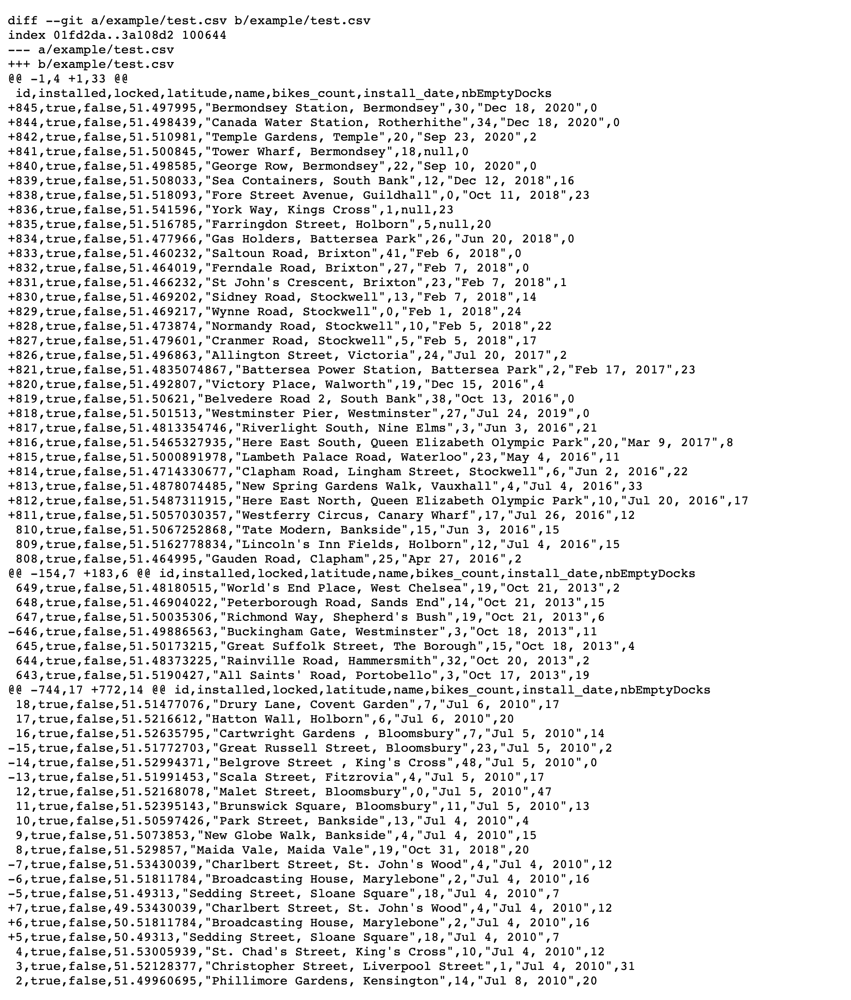
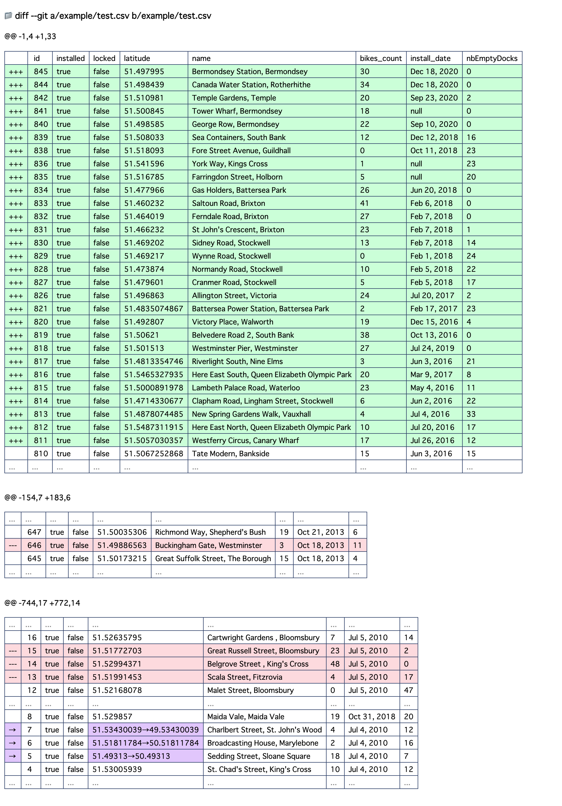

# github-csv-diff

> Extend GitHub's diff view to make csv diffs easier to read

GitHub provides a page that only shows diffs with a .diff at the end of the URL of the pull request.
This Chrome Extension makes it easier to view csv diffs by using [daff](https://paulfitz.github.io/daff/) on that page.

### Before

### After

## Install

- [**Chrome** extension][link-cws] [][link-cws]

[link-cws]: https://chrome.google.com/webstore/detail/github-csv-diff/dojeallnmgbmdjoboklnojkdfenfgiek "Version published on Chrome Web Store"

### Demo

You can see [demo diff view](https://github.com/banyan/github-csv-diff/pull/1.diff) after installed extension.
(Add `.diff` to the end of the pull request, e.g. `https://github.com/banyan/github-csv-diff/pull/1` for the URL `https://github.com/banyan/github-csv-diff/pull/1.diff`)

### How it works

* Apply only when the diff is comparing csv to csv. otherwise, the original diff is displayed as is.
* If the number of differences is large, it takes a little time to display. (e.g. 20,000 lines in about 20 or 30 seconds on my environment), but otherwise, it's better to view the diff locally.
